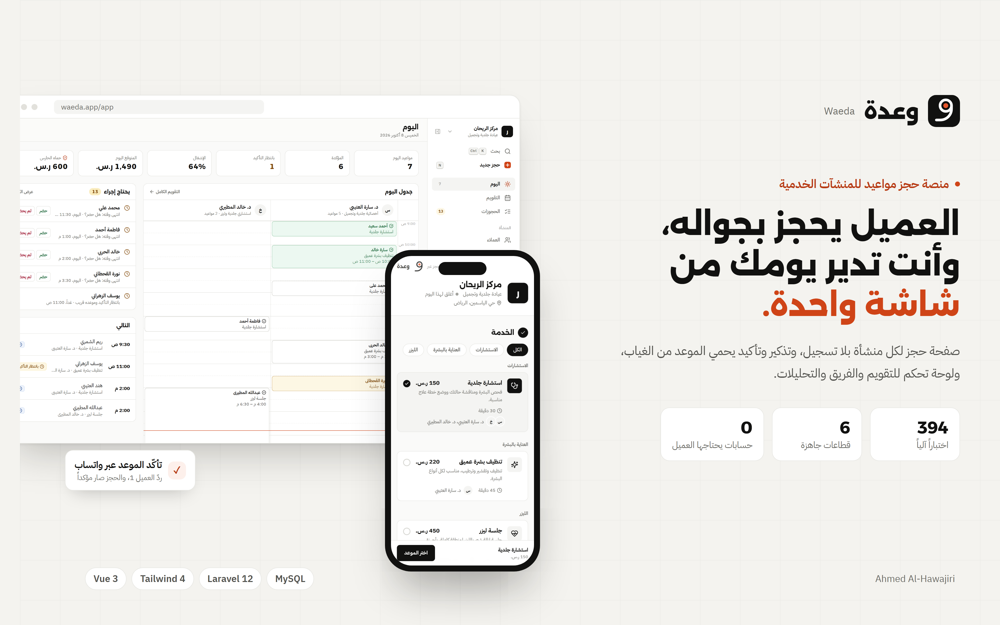

<p align="center">
  
</p>

# Waeda (وعدة)

**Arabic-first appointment booking for service businesses.** Customers book from their phone without creating an account; the business runs its whole day from one console, and an appointment guard keeps booked times from going empty.

[](https://booking-management-system-xi.vercel.app/)

**Live demo: [booking-management-system-xi.vercel.app](https://booking-management-system-xi.vercel.app/)**
No sign-up needed. The public site is the customer's side; open `/login` and use the demo account to reach the operator console at `/app`.

Built as a working product rather than a screen mockup. Availability, conflicts, pricing and opening hours are computed by real rules, enforced on the server, and covered by tests.

---

## What it does

### For the customer

- **A booking page per business** at `/b/{slug}`: pick a service, a person or a place, a day and a time.
- **No account.** The phone number is the identity, verified once per device with a code over WhatsApp.
- **Length and price.** Services can offer several lengths (60, 90, 120 minutes), with the price following the length and an evening peak price where the business sets one.
- **Group classes.** A class runs at set weekly times; the guest picks a session and sees how many seats are left.
- **My booking.** Look a booking up, move it to another free time, or cancel it, within the business's own rules.

### For the business

- **Today:** the day as one column per person, with drag and drop to move a booking, click on empty time to create one, a live now-line, and a queue of what needs action.
- **Calendar:** day, week and list views.
- **New booking window:** customer and service, a month calendar, and the day's free times side by side. A returning customer is recognised by their number, with "same as last time" in one tap. Weekly series for regular slots.
- **Bookings and customers:** sortable tables, filters, per-customer history and no-show rate.
- **Analytics:** occupancy, revenue, no-show and cancellation rates, demand by hour, performance by person.
- **Settings:** business profile, services, team (people or places such as courts and rooms), opening hours, special periods, prayer pauses, and the guard's policy.
- **Six ready sectors** to start from: clinics, salons, training centres, home services, restaurants, and courts.

### The appointment guard

Missed appointments are the costly problem for these businesses, so the guard works on them directly:

- **Reminders and confirmation.** The customer answers 1 to confirm, 2 to cancel, or 3 to move the booking.
- **Risk scoring** from the customer's own history, explained in plain words.
- **Inbox.** A reply the guard cannot read goes to the team, and their answer closes it.
- **Refill.** A cancelled slot is offered to the waitlist and to customers likely to take it.
- **Free-form replies** ("خليها بكرة بعد المغرب") are read by a language model when `AI_API_KEY` and `AI_MODEL` are set, and by word lists otherwise. The model never receives the customer's name or phone.

### Built for the region

- **Hours past midnight.** A day can open at 16:00 and close at 02:00; the 01:00 booking belongs to the evening before.
- **Ramadan and special periods** with their own hours, dated by the Umm al-Qura calendar.
- **Prayer pauses** computed automatically for 20 cities across Saudi Arabia, the Gulf, Egypt and Jordan, with a longer pause on Friday.
- **Female or male specialists** as a filter on the booking page.
- **Full RTL** using logical properties, with Latin digits and LTR islands for phone numbers.

---

## The part that matters

Most booking demos store a time as text and let you double-book. This one does not.

**Availability is computed, not stored.** Free times are generated from the service's length and buffer, the person or place being booked, the business-day window (which may cross midnight), special periods and prayer pauses. Times already past are left out.

**Conflicts use half-open interval overlap**, `aStart < bEnd && bStart < aEnd`, so a booking ending at 10:00 and one starting at 10:00 do not collide. Seats in the same class session share the time up to the class's capacity; anything else at that time is still a clash.

**The rule is enforced where it counts.** The API locks the resource row and tests for an overlap inside the transaction that writes the booking, so of two operators confirming the same slot in the same second, the second one loses. `api/tests/Feature/ConcurrentBookingTest.php` proves it with two live connections.

**The server sets the price.** Peak and length pricing is computed by `App\Services\Pricing`; whatever price a client sends is ignored.

**One rule, two places, the same tests.** Opening hours and pricing exist in both the browser (`src/lib/hours.js`, `src/lib/pricing.js`) and the API (`app/Services/Hours.php`, `app/Services/Pricing.php`), and both are tested against the same cases, so the demo and the real backend agree.

---

## Plans

Waeda has its own subscriptions: **Free**, **Basic** and **Pro**, which differ in team size, monthly WhatsApp messages, refill and deposits. Every new business starts on a 14-day Pro trial.

There is no payment gateway yet. An upgrade is recorded as a request and activated by hand with `php artisan waeda:activate {slug} {plan}`. On the demo it activates at once.

---

## Tech stack

**Front end:** Vue 3.5 with `<script setup>`, JavaScript (ES modules, JSDoc types), Vite 6, Tailwind CSS 4 with `@theme` tokens, Pinia, Vue Router 4, date-fns, Chart.js, lucide-vue-next, adhan (prayer times).

**Back end:** Laravel 12, PHP 8.2, MySQL or MariaDB, Sanctum for token auth, islamic-network/prayer-times.

**Data seam:** a repository interface with two implementations, `localStorage` and the Laravel API. One environment variable picks between them and nothing above the seam changes. This is also what keeps the live demo running as a static bundle.

---

## Tests

| Suite | What it covers | Count |
|---|---|---|
| PHPUnit (`api/tests`) | bookings, concurrency, access control, hours, prayer pauses, venues, classes, the guard, subscriptions, password reset. Runs against a real MySQL database, not sqlite | 217 |
| Vitest (`src/**/__tests__`) | slot engine, hours, pricing, sessions, risk, stores | 177 |
| Playwright (`scripts/qa.mjs`) | an end-to-end walk through the guest flow and every console screen, on three viewports, failing on any console error | 1 run |

```bash
npm test              # Vitest
npm run api:test      # PHPUnit
npm run qa            # Playwright walkthrough (needs the dev server running)
```

---

## Getting started

```bash
npm install
npm run dev           # http://localhost:5173
```

No backend or database is required: the app runs on `localStorage` with seed data that is re-dated to the current day.

### With the real backend

```bash
cd api
cp .env.example .env && php artisan key:generate
mysql -u root -e "create database booking_management character set utf8mb4"
php artisan migrate --seed
php artisan serve --port=8000
```

Then point the front end at it:

```bash
echo "VITE_API_URL=http://localhost:8000/api" > .env.local
npm run dev
```

The seeder creates an operator, `operator@example.com` / `password`. `FRONTEND_URL` in `api/.env` must match the front end's address for password-reset links. In production, set real mail (SMTP) settings so those links are delivered. [`api/README.md`](api/README.md) covers the API in more detail.

Other scripts:

```bash
npm run build         # production build
npm run format        # Prettier with the Tailwind class sorter
npm run check:secrets # scan for committed keys before pushing
```

---

## Project structure

```
src/
  lib/availability.js       slot generation, conflicts, occupancy
  lib/hours.js              business-day windows, past midnight and special periods
  lib/prayer.js             prayer pauses by city
  lib/pricing.js            length and peak pricing
  lib/sessions.js           class sessions and seats
  lib/guardEngine.js        the appointment guard on the demo backend
  data/repository.js        persistence seam: localStorage or the API
  stores/                   Pinia stores: bookings, customers, guard, settings, subscription
  views/                    public pages, and the /app console under views/app
  components/booking/       booking window, month calendar, day columns, drawers
scripts/qa.mjs              end-to-end walkthrough
api/
  routes/api.php            the whole API surface, on one screen
  app/Services/             BookingWriter, Hours, Pricing, Subscription
  app/Services/Guard/       reminders, replies, risk, refill
  database/migrations/      the schema
  tests/Feature/            20 feature suites
```

---

## Author

**Ahmed Al-Hawajiri**, Full-Stack Developer
[GitHub](https://github.com/ahmedalhawajri89) · [LinkedIn](https://www.linkedin.com/in/ahmedalhawajri)

Licensed under the MIT License.

---

<div dir="rtl">

## نبذة بالعربية

**وعدة** منصة حجز مواعيد عربية للمنشآت الخدمية: العيادات والصالونات ومراكز التدريب والخدمات المنزلية والمطاعم والملاعب.

**التجربة الحية:** [booking-management-system-xi.vercel.app](https://booking-management-system-xi.vercel.app/) بدون تسجيل. الصفحة العامة هي جهة العميل، ولوحة التحكم على `/app` بالدخول بالحساب التجريبي.

**للعميل:** لكل منشأة صفحة حجز خاصة. العميل يحجز برقم جواله بدون إنشاء حساب، ويختار الخدمة والمختص واليوم والوقت، ويقدر يعدّل موعده أو يلغيه لاحقاً.

**للمنشأة:** لوحة تحكم فيها جدول اليوم بعمود لكل مختص، والتقويم، والحجوزات، والعملاء، والتحليلات، والإعدادات.

**حارس المواعيد** يقلل الغياب: يذكّر العميل ويطلب تأكيده، ويقدّر احتمال الغياب، ويعرض الموعد الملغى على قائمة الانتظار.

**مبنية للمنطقة:**
- دوام يمتد بعد منتصف الليل.
- ساعات خاصة لرمضان بتقويم أم القرى.
- حجب أوقات الصلاة تلقائياً حسب المدينة.
- فلتر المختصات والمختصين.
- واجهة من اليمين لليسار بالكامل.

**المنطق الأساسي:**
- الأوقات المتاحة تُحسب لحظياً ولا تُخزَّن.
- الخادم يمنع الحجز المزدوج داخل نفس المعاملة التي تكتب الحجز.
- السعر يحدده الخادم وحده.

**التقنيات:**
- **الواجهة:** Vue 3 وTailwind CSS 4 وPinia.
- **الخادم:** Laravel 12 وMySQL.
- **الاختبارات:** 217 اختبار PHPUnit، و177 اختبار Vitest، وفحص شامل بـ Playwright.

</div>
